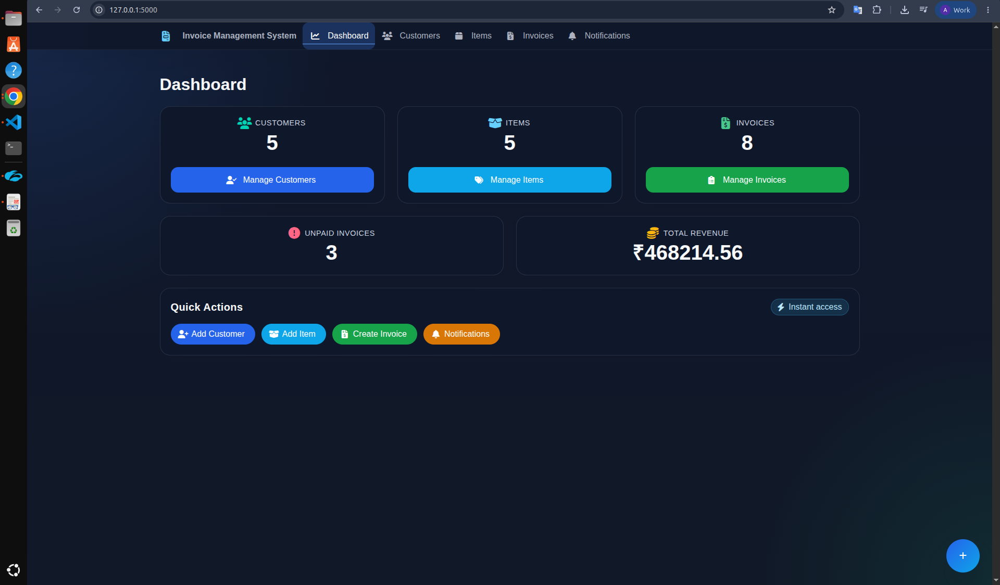
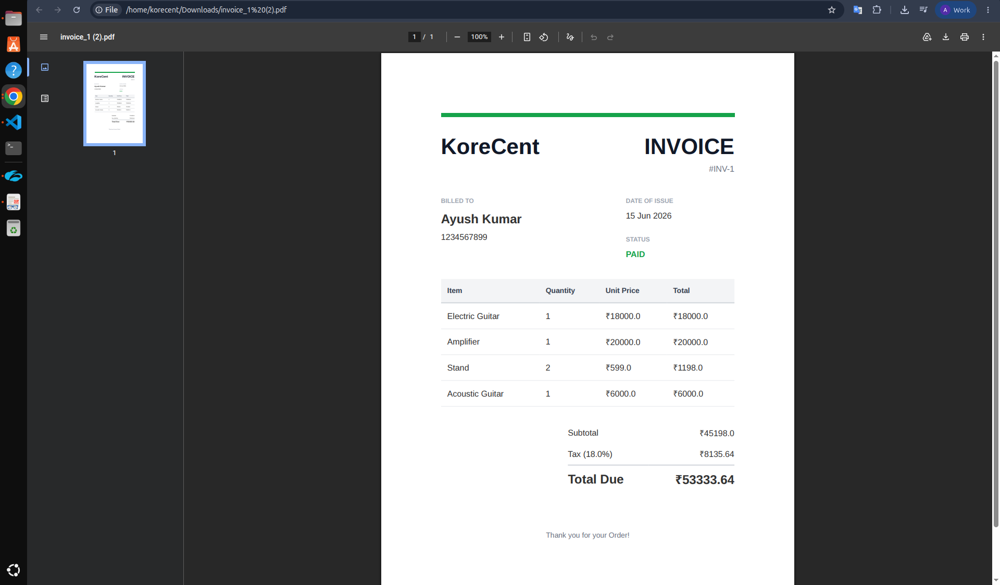

# 🚀 Invoice Management System

A modern **Flask-based Invoice Management System** built to manage customers, items, invoices, payments, notifications, and PDF generation with support for background task processing using **Celery** and **Redis**.

---

## ✨ Features

### 👥 Customer Management

* Add Customers
* Edit Customers
* Delete Customers

### 📦 Item Management

* Add & Manage Items
* Price Tracking

### 🧾 Invoice Management

* Create Invoices
* View Invoice Details
* Search Invoices
* Track Payment Status

### 📄 PDF Generation

* Generate Professional Invoice PDFs
* Download Invoice Reports

### 🔔 Notifications

* Unpaid Invoice Reminders
* Scheduled Notifications using Celery Beat

### ⚡ Performance

* Redis Caching
* Background Task Processing with Celery

### 📊 Dashboard

* Customer Statistics
* Invoice Statistics
* Revenue Overview
* Unpaid Invoice Tracking

### 🎨 User Interface

* Responsive Design
* Bulma CSS
* Interactive Dashboard
* Flash Messages

---

## 🛠️ Tech Stack

| Category        | Technology   |
| --------------- | ------------ |
| Backend         | Flask        |
| Database        | SQLite       |
| ORM             | Peewee       |
| Cache           | Redis        |
| Background Jobs | Celery       |
| Scheduler       | Celery Beat  |
| PDF Generation  | WeasyPrint   |
| Frontend        | Bulma CSS    |
| Version Control | Git & GitHub |

---

## 📸 Screenshots

### 📊 Dashboard



### 📄 Invoice PDF


---

## ⚙️ Setup & Run

### 1️⃣ Clone Repository

```bash
git clone <repository-url>
cd invoice_app
```

### 2️⃣ Install Dependencies

```bash
pip install -r requirements.txt
```

### 3️⃣ Start Redis

```bash
redis-server
```

### 4️⃣ Start Celery Worker

```bash
celery -A tasks worker --loglevel=info
```

### 5️⃣ Start Celery Beat Scheduler

```bash
celery -A celery_app beat --loglevel=info
```

### 6️⃣ Run Flask Application

```bash
python app.py
```

Application will be available at:

```text
http://127.0.0.1:5000
```

---

## 📚 Learning Outcomes

* Flask Routing & Views
* CRUD Operations
* Template Rendering with Jinja2
* Database Design using Peewee ORM
* Redis Caching
* Asynchronous Tasks with Celery
* Task Scheduling with Celery Beat
* PDF Generation using WeasyPrint
* Background Job Processing
* Git & GitHub Workflow

---

## 🌟 Future Improvements

* User Authentication
* Role-Based Access Control
* Email Notifications
* Invoice Charts & Analytics
* Export to Excel
* Docker Deployment

---

## 👨‍💻 Author

**Ayush Kumar Kashyap**


---
